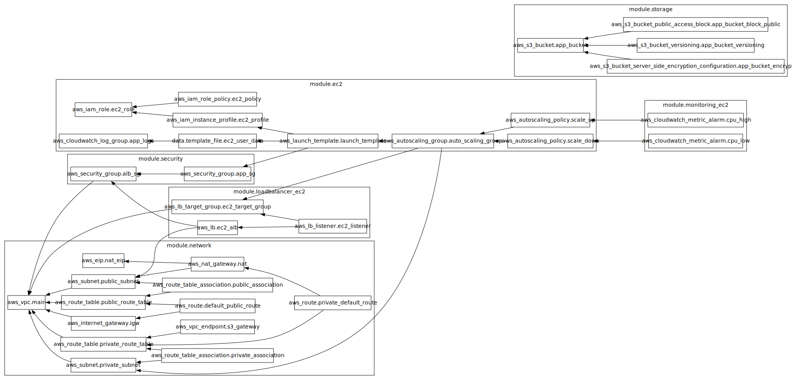
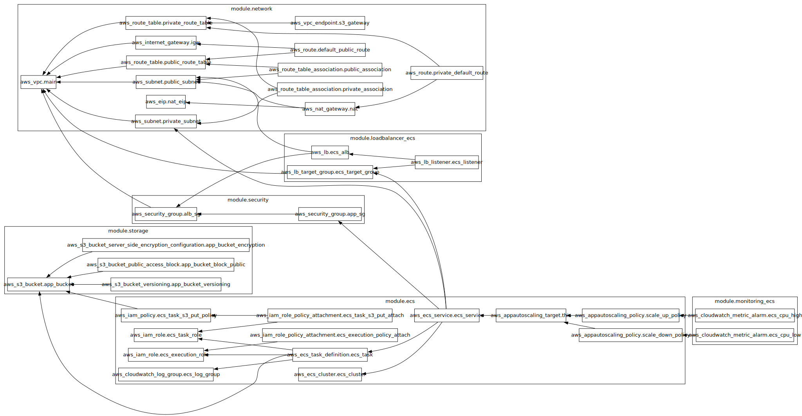

# Cloud Solutions Inc. – Terraform Infrastructure for Global Web Application

## Table of Contents

- [Project Overview](#project-overview)
- [Prerequisites](#prerequisites)
- [Quickstart](#quickstart)
- [Remote State Setup](#remote-state-setup)
- [Cloning the Repository](#cloning-the-repository)
- [Deployment Options](#deployment-options)
- [How to Deploy Application Code](#how-to-deploy-application-code)
- [How to Start Using the Project](#how-to-start-using-the-project)
- [Application Developed](#application-developed)
- [Design Decisions](#design-decisions)
- [AWS Infrastructure Resources](#aws-infrastructure-resources)
  - [EC2](#ec2)
  - [ECS](#ecs)
- [Future Solutions](#future-solutions)

## Project Overview

This repository contains **Terraform configurations** to deploy a **robust**, **scalable**, and **secure AWS infrastructure** for Cloud Solutions Inc.’s new web application, designed to serve **thousands of users globally**.

> **Note**: This solution deploys resources to the AWS region **eu-central-1**.  <br/>
> - Required variables can be found in the `variables.tf` file, and a pre-filled `.tfvars` file is available under the `environments/qa/` folder.<br/>
> - If you choose the EC2 deployment method (Right now, is the uncomment solution), uncomment all the commented variables on the variables.tfvars and variables.tf for EC2 and the same applies to the ECS.<br/>
> - The variable that will require a major change will be: ecr_container_image = "163381208010.dkr.ecr.eu-central-1.amazonaws.com/container-app-01:v1.0.0", since the account id will be different repository/app version.
> - All parameters are configurable via variables—including the initial, desired, and maximum number of compute instances, as well as the CPU utilization thresholds that trigger scaling alarms.
> - The steps needed to follow are in sequence while reading this README.

## Prerequisites

Before you begin, ensure you have the following installed and configured:

- **Terraform** ≥ v1.11.4  
- **AWS CLI** (configured via `aws configure` with a default aws profile, the profile can be configured on the providers.tf)  
- **Docker**


### Quickstart

1. Clone the repo: 
```bash
   git clone https://github.com/CarlosMiguelAzevedoCampos/cloudsolutions-01.git
```


## Remote State Setup

This project uses a **remote backend** to securely store the Terraform state in AWS. The configuration for the remote state can be found on the file: **backend.tf** in the root folder of the project.

Follow these steps:

### 1. Create an S3 Bucket for Terraform State Storage

```bash
aws s3api create-bucket   --bucket cloudsolutions-terraform-state   --region eu-central-1   --create-bucket-configuration LocationConstraint=eu-central-1
```

### 2. Enable Versioning on the S3 Bucket

```bash
aws s3api put-bucket-versioning   --bucket cloudsolutions-terraform-state   --versioning-configuration Status=Enabled
```

### 3. Create a DynamoDB Table for State Locking

```bash
aws dynamodb create-table   --table-name terraform-lock   --attribute-definitions AttributeName=LockID,AttributeType=S   --key-schema AttributeName=LockID,KeyType=HASH   --provisioned-throughput ReadCapacityUnits=5,WriteCapacityUnits=5   --region eu-central-1
```

These resources allow Terraform to **store** and **lock** the state file remotely, ensuring **safe concurrent operations** and **preventing state corruption**.

## Application developed

To enable user interaction for this demonstration, an web application that accepts customer input and securely stores it in an Amazon S3 bucket was created.

## Deployment Options

This project provides **two alternative deployment architectures** to support different operational needs and showcase flexibility.

### How to Choose Between EC2 and ECS Deployments

In the `main.tf` file, both deployment options (EC2 and ECS Fargate) are prepared.

### Why Two Implementations?

- **Adapt to incomplete requirements**: Customer preferences around operational control, management responsibilities, and cost were not fully defined. That would require to sit with the customer to understand is needs.
- **Demonstrate technical knowledge** and the ability to deliver multiple solutions.


### Instructions
- By default, one of the solutions is commented out to avoid conflicts.
- To switch between ECS and EC2 deployments, manually comment or uncomment the corresponding blocks on the main.tf file, variables.tf and variables.tfvars and follow what is found on the topic [How to Start Using the Project](#how-to-start-using-the-project).

- **To deploy the EC2-based solution**:
  - Comment out the ECS Fargate–related sections in main.tf, variables.tf, and variables.tfvars.
  - Uncomment the EC2–related sections in main.tf, variables.tf, and variables.tfvars.
  - Instances are automatically bootstrapped at launch using EC2 User Data. You can review the exact configuration in the cloudsolutions-app-userdata.sh script located in the modules/compute/ec2/directory. There you can find comments saying what is being done in each step.

- **To deploy the ECS Fargate-based solution**:
  - Comment out the EC2–related sections in main.tf, variables.tf, and variables.tfvars.
  - Uncomment the ECS Fargate–related sections in main.tf, variables.tf, and variables.tfvars.

### Deployment Options

- **Option 1: EC2-based Deployment**
  - Traditional approach using **Amazon EC2** instances, **Elastic Load Balancer (ELB)**, and **CloudWatch** for monitoring.
  - Full control over the underlying virtual machines and operating system.
  - Requires management of OS updates.

- **Option 2: ECS Fargate-based Deployment**
  - Serverless container orchestration using **Amazon ECS with Fargate**.
  - AWS abstracts server management and maintenance.
  - Focus on deploying containers without managing the underlying infrastructure.

### Key Decision Factors

- 🔹 **Operational Control**: Do you want full control (EC2) or prefer AWS to manage the infrastructure (Fargate)?
- 🔹 **Infrastructure Management**: Do you want to handle OS updates and maintenance, or leave it to AWS?
- 🔹 **Cost Sensitivity**: EC2 may be cheaper but requires more management; Fargate offers simplicity at a potentially higher cost.

## How to Deploy Application Code

Before running terraform init and terraform apply, the application code/docker image needs to be deployed to AWS, and the files can be located in the `files/` directory.

It includes:
- `app.py`: A simple Python-based website that allows input to be saved to an S3 bucket.
- `Dockerfile`: Used to containerize the app.
- `requirements.txt`: Lists the necessary Python dependencies.

### EC2 Deployment

Upload the app to a new S3 bucket:

```bash
aws s3api create-bucket   --bucket cloudsolutions-code-app-01   --region eu-central-1   --create-bucket-configuration LocationConstraint=eu-central-1

aws s3api put-bucket-versioning   --bucket cloudsolutions-code-app-01   --versioning-configuration Status=Enabled

aws s3 cp files/app.py s3://cloudsolutions-code-app-01/
aws s3 cp files/requirements.txt s3://cloudsolutions-code-app-01/
```

### ECS Fargate Deployment

1. Create an ECR repository:

```bash
aws ecr create-repository --repository-name [your_repository_name]
```

2. In the AWS Console, navigate to your repository and click on **View push commands**. Follow the instructions provided.

3. Update your `.tfvars` file with the correct ECR image URI:
```hcl
ecr_container_image = "163381208010.dkr.ecr.eu-central-1.amazonaws.com/container-app-01:v1.0.0"
```

## How to Start Using the Project

After choosing your deployment option:

1. Initialize the project:

```bash
terraform init
```

2. Validate the resources with:

```bash
terraform plan -var-file="environments/qa/variables.tfvars"
```

3. Apply the configuration:

```bash
terraform apply -var-file="environments/qa/variables.tfvars"
```

Ensure the `.tfvars` file is properly filled before running the commands.

---

## Design decisions

### Network Architecture
A fully isolated VPC was provisioned with both public and private subnets. I placed all ECS and EC2 instances in private subnets and routed outbound internet traffic through a NAT Gateway for software installations and updates. This configuration minimizes the attack surface by preventing direct inbound connections. All HTTP (port 80) requests arrive exclusively via an Application Load Balancer, as specified in my load-balancer and security modules.

### Storage Design
Instead of deploying a traditional database, I chose Amazon S3 for its cost efficiency, scalability, and simplicity, as my web application only needs to persist minimal user input. To ensure that all data transfers between ECS/EC2 and S3 remain on AWS’s private network, I created a VPC Gateway Endpoint, providing secure, high-performance connectivity without traversing the public internet.
To further optimize storage costs without sacrificing performance, I configured Amazon S3 Intelligent-Tiering for the bucket. Intelligent-Tiering automatically moves objects between frequent and infrequent access tiers based on usage patterns, ensuring that I pay the lowest storage cost possible without needing to manually set lifecycle policies. Since my application's user input is minimal and access patterns can vary over time, Intelligent-Tiering provides an ideal balance between cost savings and data retrieval speed, without operational overhead. This design choice supports long-term scalability while keeping operational costs predictable and low. Even doe it only applies to files over 128kb, it is a future proof-approach.

### Auto Scaling
CloudWatch alarms were provisioned to monitor CPU utilization and automatically trigger scaling actions. When usage crosses predefined thresholds, these alarms adjust the Auto Scaling Group’s capacity. This configurations can be done by the variables present on the variables.tf

### CloudWatch Logs
All application logs are stored in CloudWatch Logs with an infinite retention policy.

### IAM Roles
Principle of least privilege is applied. EC2 instances are granted GetObject/PutObject permissions on the S3 bucket, while ECS tasks only have PutObject permissions.

### Compute - EC2 - ECS

Implemented two architectures—one using EC2 instances and another leveraging ECS Fargate—allowing us to select the optimal solution based on each customer’s requirements.

## AWS Infrasctruture Resources

This was generated with:


```bash
terraform graph
```


### EC2



### ECS




## Future solutions

1. Implement HTTPS.
2. Integrate Route 53 for DNS management.
3. Finalize the deployment approach based on requirements.
4. With this, we can follow any compute approach, since we have already a backbone for an AWS LandingZone.
